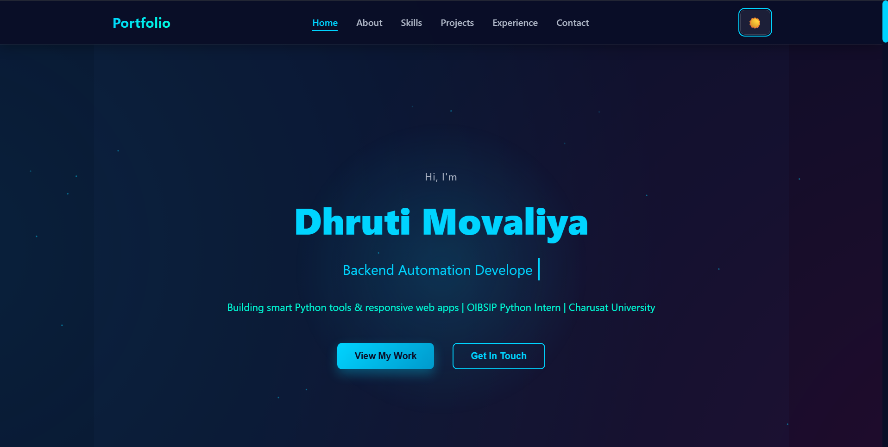
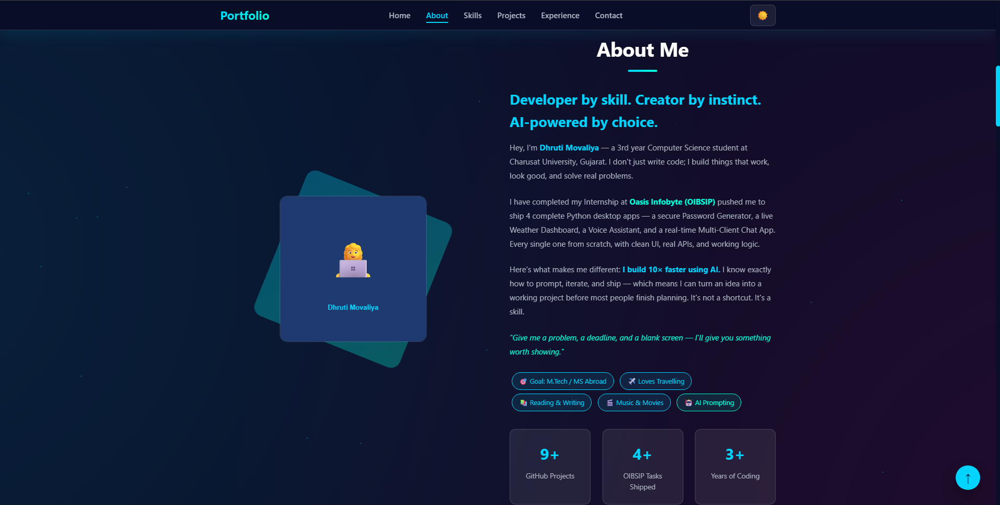
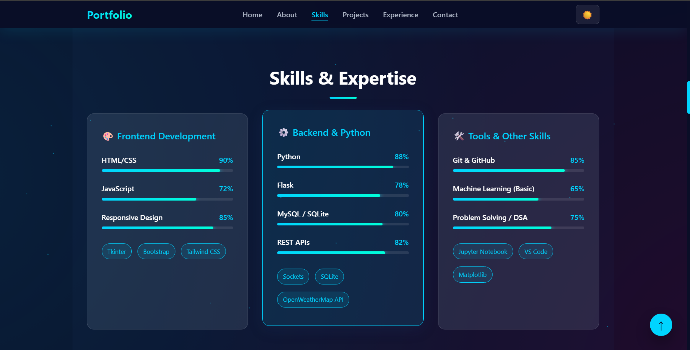
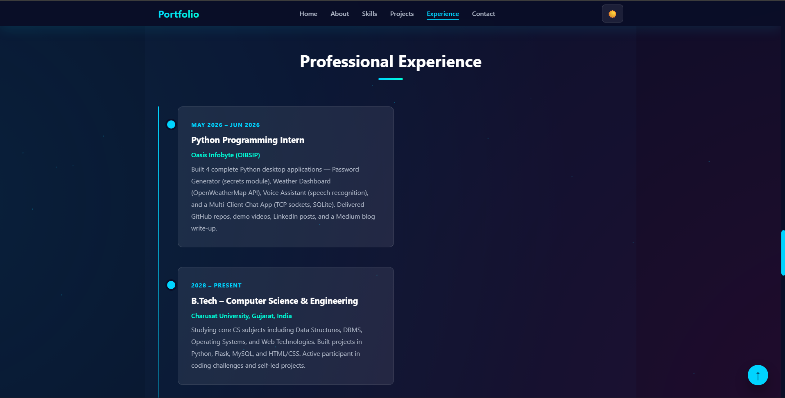
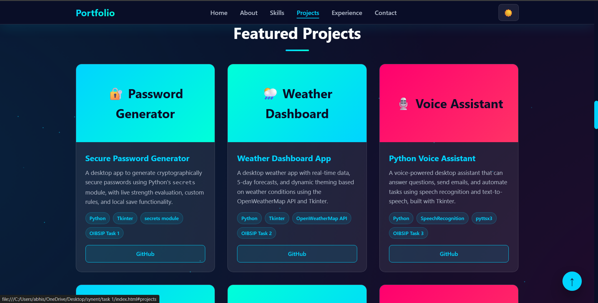
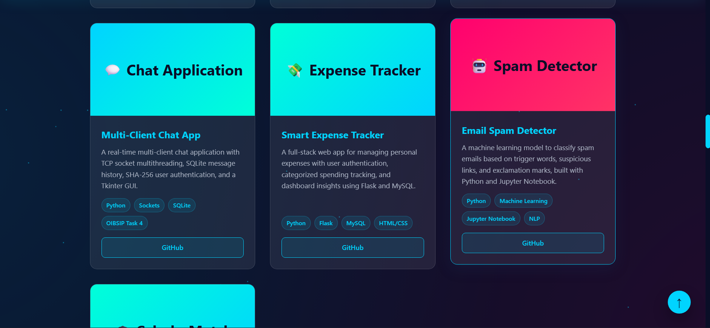
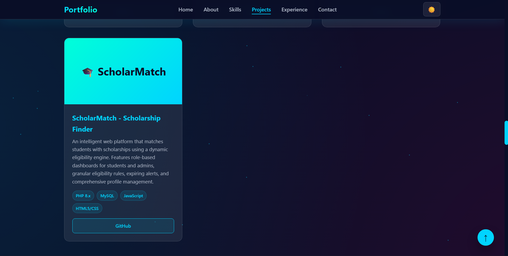
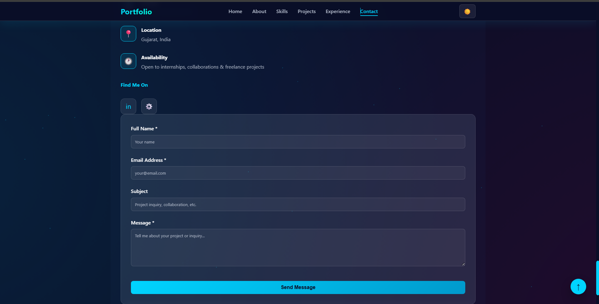
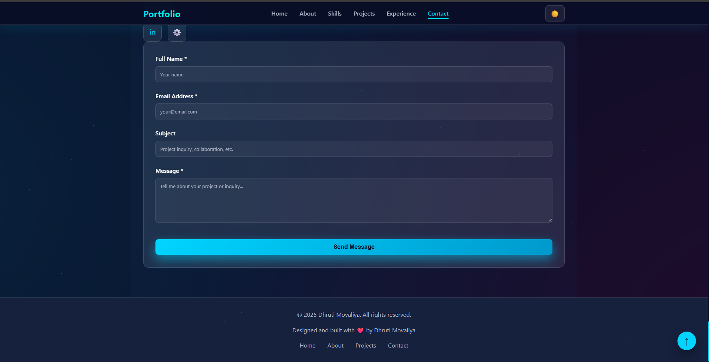

# 🎨 Personal Portfolio Website - Dhruti Movaliya

A modern, responsive portfolio website showcasing Python projects, web development skills, and professional experience as a Computer Science student and OIBSIP intern.

**Live Demo:** [Portfolio Website](https://github.com/DhrutiM39/synent-task1-Personal-Portfolio-Website-Dhruti)

---

## ✨ Features

- 🌙 **Dark/Light Theme Toggle** - Persistent theme preference with localStorage
- 📱 **Fully Responsive Design** - Mobile-first approach for all devices
- ✨ **Smooth Animations** - Glassmorphism effects, fade-in transitions, and particle background
- ⌨️ **Typing Animation** - Dynamic role/subtitle text animation
- 🎯 **Interactive Navigation** - Sticky navbar with hamburger menu
- 📊 **Skills Progress Bars** - Visual representation of technical proficiency
- 📈 **Counter Animation** - Animated statistics that count up on scroll
- 💬 **Contact Form** - With real-time validation and error handling
- 🔝 **Scroll to Top Button** - Smooth scroll functionality

---

## 📁 Project Structure

```
synent/
├── index.html          # Main portfolio page
├── README.md           # Documentation
└── task 1/             # Task submissions folder
```

---

## 🚀 Projects Showcased

### 1. **🔐 Secure Password Generator**
- **Tech Stack:** Python, Tkinter, secrets module
- **Features:** Cryptographically secure password generation, strength evaluation, custom rules
- **GitHub:** [View Project](https://github.com/DhrutiM39/OIBSIP_PythonProgramming_Task1)

### 2. **🌦️ Weather Dashboard App**
- **Tech Stack:** Python, Tkinter, OpenWeatherMap API
- **Features:** Real-time weather data, 5-day forecast, dynamic theming
- **GitHub:** [View Project](https://github.com/DhrutiM39/OIBSIP_PythonProgramming_Task2)

### 3. **🎙️ Python Voice Assistant**
- **Tech Stack:** Python, SpeechRecognition, pyttsx3, Tkinter
- **Features:** Voice-powered desktop assistant, email automation, task execution
- **GitHub:** [View Project](https://github.com/DhrutiM39)

### 4. **💬 Multi-Client Chat App**
- **Tech Stack:** Python, TCP Sockets, SQLite, Tkinter
- **Features:** Real-time messaging, user authentication, message history
- **GitHub:** [View Project](https://github.com/DhrutiM39)

### 5. **💸 Smart Expense Tracker**
- **Tech Stack:** Python, Flask, MySQL, HTML/CSS
- **Features:** User authentication, categorized spending, dashboard insights
- **GitHub:** [View Project](https://github.com/DhrutiM39/Smart-Expense-Tracker)

### 6. **🤖 Email Spam Detector**
- **Tech Stack:** Python, Machine Learning, Jupyter Notebook, NLP
- **Features:** Spam classification, pattern recognition, accuracy metrics
- **GitHub:** [View Project](https://github.com/DhrutiM39/spam-detector)

### 7. **🎓 ScholarMatch - Scholarship Finder**
- **Tech Stack:** PHP 8.x, MySQL, JavaScript, HTML5/CSS3
- **Features:** Intelligent eligibility engine, role-based dashboards, deadline alerts
- **GitHub:** [View Project](https://github.com/DHRUPAL5404/Scholarship-finder)

---

## 💻 Technology Stack

### Frontend
- **HTML5** - Semantic markup
- **CSS3** - Glassmorphism design, CSS variables, animations
- **JavaScript (Vanilla)** - No frameworks, pure JS for performance

### Design & UX
- Responsive grid layouts
- CSS custom properties for theming
- Smooth animations & transitions
- Accessible ARIA labels

### Tools & Services
- Git & GitHub for version control
- VS Code for development
- OpenWeatherMap API (integrated projects)

---

## 🎨 Design Highlights

### Color System
- **Primary:** `#00d4ff` (Cyan)
- **Secondary:** `#ff006e` (Pink)
- **Accent:** `#00ffd9` (Turquoise)
- **Dark Background:** `#0a0e27`

### Interactive Elements
- Hover effects on project cards
- Active navigation link indicators
- Form field focus states
- Animated progress bars
- Particle background effects

### Accessibility
- Semantic HTML structure
- ARIA labels on buttons
- Keyboard navigation support
- Focus indicators on interactive elements
- Color contrast compliance

---

## 📋 Features in Detail

### 1. **Theme Toggle**
- Switches between dark and light modes
- Persists preference in localStorage
- Smooth transition between themes

### 2. **Navigation**
- Sticky navbar with smooth scroll
- Hamburger menu for mobile devices
- Active link highlighting on scroll
- Smooth scroll to section behavior

### 3. **Hero Section**
- Large, eye-catching title with gradient text
- Typing animation for role/subtitle
- Call-to-action buttons
- Animated background with particles

### 4. **About Section**
- Personal introduction
- Key achievements and skills
- Animated statistics (counter animation)
- Personal interests/hobbies badges

### 5. **Skills Section**
- Three skill categories (Frontend, Backend, Tools)
- Animated progress bars
- Skill level percentages
- Technology badges

### 6. **Projects Section**
- 7 featured projects with descriptions
- Project category tags
- GitHub links for each project
- Hover animations and gradient backgrounds

### 7. **Experience Section**
- Timeline layout
- Professional experience entries
- Education history
- Animated timeline markers

### 8. **Contact Section**
- Contact information cards
- Social media links
- Contact form with validation
- Real-time error feedback

---

## 🎯 Usage

### Customization

1. **Update Personal Information:**
   - Modify text in hero section
   - Update about section content
   - Change contact details

2. **Change Colors:**
   - Edit CSS variables in `:root` selector
   - Update primary, secondary, and accent colors

3. **Add/Remove Projects:**
   - Duplicate project card HTML
   - Update project details
   - Add new GitHub links

4. **Toggle Theme:**
   - Click the theme button (🌙/☀️) in navbar
   - Preference is saved automatically

---

## 📸 Screenshots

Here are some visual highlights of the Personal Portfolio Website:

### 🏠 Home & About Section
| Home | About |
| --- | --- |
|  |  |

### 🛠️ Skills & Experience
| Skills | Experience |
| --- | --- |
|  |  |

### 📁 Featured Projects
| Password Generator | Weather Dashboard | Voice Assistant |
| --- | --- | --- |
|  |  |  |

### 💬 Contact & Footer
| Contact & Achievements | Contact Form | Footer |
| --- | --- | --- |
|  |  |  |

---

## 📊 Performance

- **Lightweight:** No external dependencies
- **Fast Loading:** Optimized CSS and vanilla JavaScript
- **Mobile Optimized:** Responsive design with mobile-first approach
- **Accessibility:** WCAG 2.1 compliance

---

## 🔗 Live Links

- **Portfolio:** [View Live](https://dhruti-movaliya-portfolio.com) *(if deployed)*
- **GitHub:** [DhrutiM39](https://github.com/DhrutiM39)
- **LinkedIn:** [Dhruti Movaliya](https://www.linkedin.com/in/dhruti-movaliya)

---

## 📝 Sections Breakdown

| Section | Purpose | Features |
|---------|---------|----------|
| **Home** | Hero section | Title, typing animation, CTA buttons |
| **About** | Personal introduction | Bio, achievements, interests, stats |
| **Skills** | Technical proficiency | Progress bars, categories, badges |
| **Projects** | Work showcase | 7 projects, descriptions, links |
| **Experience** | Professional timeline | Internship, education, independent work |
| **Testimonials** | Achievements | Highlights, badges, accomplishments |
| **Contact** | Get in touch | Info, social links, contact form |

---

## 🛠️ JavaScript Classes

### ThemeManager
- Handles dark/light mode toggling
- Persists preference in localStorage

### TypingAnimation
- Creates animated text effect
- Cycles through phrases with typing/erasing

### ParticleGenerator
- Creates animated particle background
- Configurable particle count

### NavigationManager
- Sticky navbar functionality
- Hamburger menu for mobile
- Active link highlighting

### FormManager
- Real-time form validation
- Error message handling
- Form submission logic

### CounterAnimator
- Animates statistics on scroll
- Counts up to target numbers

### ScrollToTopButton
- Shows/hides based on scroll position
- Smooth scroll to top

---

## 📱 Responsive Breakpoints

```css
Desktop:    >= 1024px
Tablet:     768px - 1024px
Mobile:     < 768px
Small Mobile: < 480px
```

---

## 🤝 Contributing

Feel free to fork this project and submit pull requests for improvements!

---


## 👤 Author

**Dhruti Movaliya**
- 3rd Year B.Tech Computer Science Student at Charusat University
- OIBSIP Python Programming Intern (May-June 2025)
- 🎯 Goal: M.Tech / MS Abroad
- 📧 Contact: [GitHub](https://github.com/DhrutiM39) | [LinkedIn](https://www.linkedin.com/in/dhruti-movaliya)

---

## 🙌 Acknowledgments

- Built with ❤️ using vanilla HTML, CSS, and JavaScript
- Inspired by modern web design trends (Glassmorphism, Dark mode)
- Particle effects and animations created from scratch

---

## 📞 Support

For questions or suggestions, feel free to reach out:
- **GitHub Issues:** [Create an issue](https://github.com/DhrutiM39/synent-task1-Personal-Portfolio-Website-Dhruti/issues)
- **Email:** Contact via LinkedIn
- **LinkedIn:** [Connect with me](https://www.linkedin.com/in/dhruti-movaliya)

---

**Made with ❤️ by Dhruti Movaliya**

---

## 🎉 Quick Links

- [View Portfolio](https://github.com/DhrutiM39/synent-task1-Personal-Portfolio-Website-Dhruti)
- [GitHub Projects](https://github.com/DhrutiM39?tab=repositories)
- [LinkedIn Profile](https://www.linkedin.com/in/dhruti-movaliya)
- [OIBSIP Internship](https://www.oasisinfobyte.com/)

---

**Last Updated:** June 16, 2025
